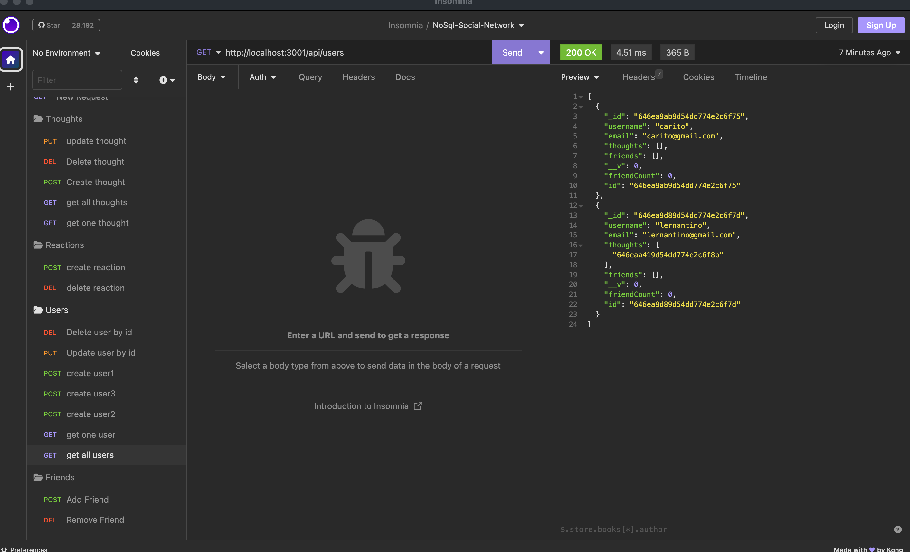

# NoSql-Social-Network-API

## Description
This application will let you express your thoughts and share them with your friends. Its a back end app where you can save new friends, thoughts and reactions. Have fun!

## Table of Contents 

- [Installation](#installation)
- [Credits](#credits)
- [License](#license)
- [Links](#links)

## Installation 

You will have to follow this steps to properly use this application:

Install the npm packages and dependencies by running the command  `npm init -y` in your terminal.
Lastly, you will run `npm start` to be able to see the data related to the routes on Insomnia or similar apps. 

## Credits

I've used all the material provided in class and stack overflow for email regex and helping me solve bugs/errors alone the way.

## License
MIT License

## Links

Git Hub Repo: https://github.com/caroHagg/NoSql-Social-Network-API

